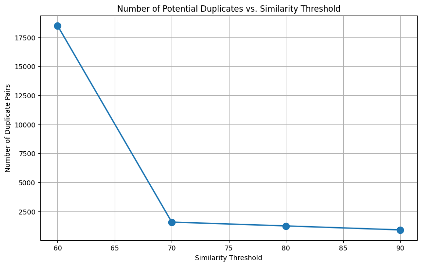

# Job Posting Duplicate Detection System

This project implements a system to identify duplicate job postings using natural language processing and vector search techniques. By generating embeddings for job descriptions and titles, the system can detect semantically similar job postings that might represent the same job listed multiple times.

## Table of Contents
- [Data Exploration](#data-exploration)
- [Technical Implementation](#technical-implementation)
  - [Embedding Generation](#embedding-generation)
  - [Vector Search Implementation](#vector-search-implementation)
- [Evaluation Methodology](#evaluation-methodology)
- [Environment Setup](#environment-setup)
- [Running the Project](#running-the-project)
- [Project Structure](#project-structure)
- [Sample Results](#sample-results)

## Data Exploration

The dataset (`jobs.csv`) contains job postings with the following key attributes:

- `jobTitle`: Title of the job position
- `companyName`: Name of the company
- `lid`: Unique identifier for each job posting
- `jobDescRaw`: HTML content of the job description
- `finalZipcode`, `finalState`, `finalCity`: Location information
- `nlpBenefits`, `nlpSkills`, `nlpSoftSkills`: Extracted attributes 
- `nlpDegreeLevel`, `nlpEmployment`, `nlpSeniority`: Job requirements

### Key Insights from Exploration:

1. **Data Distribution**: 
   - The dataset contains a diverse range of job titles across different industries
   - Most companies have multiple job postings
   - Geographic distribution shows concentration in major metropolitan areas

2. **Optimal Threshold Selection**:
   - A threshold around 70-75 appears optimal, capturing genuine duplicates while filtering out coincidental similarities
   - The sharp drop between 60-70 suggests 60 is too permissive, capturing many false positives

3. **Company-Specific Patterns**:
   - Certain companies like DoorDash seem to use highly templated job descriptions across locations, this would make it harder for separating true duplicates from false positives
   - This suggests building company-specific similarity models might be valuable. Not sure if time will permit this.

4. **Title vs. Description Complementarity**:
   - Job description similarity captures relationships that title+company similarity might miss
   - A combined approach leveraging both metrics would likely provide the most robust duplicate detection

For detailed insights check out this notebook [eda](https://github.com/harshavardhan-patil/canaria_ml_thp/blob/main/notebooks/eda.ipynb)



## Technical Implementation

### Embedding Generation
I chose the `all-MiniLM-L6-v2` model from sentence-transformers for generating embeddings for the following reasons:

1. **Efficiency**: The model provides a good balance between computational efficiency and embedding quality
2. **Embedding Dimension**: 384-dimensional embeddings offer sufficient semantic information while keeping storage requirements reasonable
3. **Domain Specific**: Based on the data, job descriptions are generally a couple of paragraphs long which is a sweet spot for this model's capabilities.

The embeddings are generated for both:
- Complete job information (combining title, company, location information and job descriptions)
- Job titles alone (for a two-step filtering approach)

### Vector Search Implementation
I used PostgreSQL with pgvector extension for vector storage and similarity search, providing:
- Efficient indexing with IVFFLAT
- Transactional integrity
- Scalable architecture

My main reason for choosing Postgres was having a single unified DB handling both my *data* and my *embeddings*

For Similarity Search I tried two approaches:

#### Job Information based similarity search with pre-filtering
This vector search implementation searches on the complete job information

1. **Pre-filtering**: 
   - Filter potential duplicates by location
   - Reduces comparison space drastically

2. **Description Similarity**:
   - Compare using complete job information embeddings (combining title, company, location information and job descriptions)

#### Hierarchical similarity search with pre-filtering

The vector search implementation uses a hierarchical approach:

1. **Pre-filtering**: 
   - Filter potential duplicates by location and company name
   - Reduces comparison space drastically

2. **Title Similarity**:
   - First level of semantic comparison using title embeddings
   - Efficient initial screening using a higher threshold (0.96)

3. **Description Similarity**:
   - Secondary level of comparison using complete job information embeddings
   - Used on candidates filtered by title similarity

4. **Weighted Score**:
   - Final similarity score combines title similarity (70% weight) and description similarity (30% weight)
   - Threshold calibrated through evaluation (0.95)

## Evaluation

The evaluation approach combines two main techniques:

1. **Transitivity Analysis**:
 - Transitivity in this context refers to: if A is similar to B, and B is similar to C, then A should be similar to C. In other words, if two items are both similar to a common third item, they should also be similar to each other.
 - If A ≈ B and B ≈ C but A ≈ C fails to be detected, it suggests that the similarity threshold between pairs might be too strict or not well-calibrated, which could lead to missing some duplicates (false negatives). Similarly, adjusting thresholds can help balance between false positives (too many incorrect duplicates) and false negatives (missing actual duplicates).

 2. **Inspecting Low Confidence Duplicates**:
 - To combat certain limitations of Transitivity Analysis, I also verified the low confidence duplicates to understand where our system was failing
 - By looking at these false positives, I was able to iteratively modify the system and tune the threshold value

My hierarchical approach resulted in a good transitivity score of 88.39% and a solid identification of duplicates while keeping the false positives to a minimum

Code in notebook [duplicates](https://github.com/harshavardhan-patil/canaria_ml_thp/blob/main/notebooks/duplicates.ipynb):

## Environment Setup

### Prerequisites
- Python 3.12
- Docker and Docker Compose
- PostgreSQL with pgvector extension

### Dependencies
All required dependencies are listed in the `requirements.txt` file.

### Docker Setup
The solution includes Docker configuration for easy deployment:
- `Dockerfile`: Defines the Python environment and installs dependencies
- `docker-compose.yml`: Sets up PostgreSQL with pgvector and the application container.

### Database Setup
The PostgreSQL database with pgvector extension is automatically configured when running with Docker Compose. The schema includes tables for:
- Raw job data
- Processed job data
- Job embeddings
- Title embeddings
- Detected duplicates

DB Schema can be found [here](https://github.com/harshavardhan-patil/canaria_ml_thp/blob/main/src/data/db_schema.py)

## Running the Project

### Using Docker Compose
1. Clone the repository:
   ```bash
   git clone https://github.com/harshavardhan-patil/canaria_ml_thp
   cd canaria_ml_thp
   ```

2. Create a `.env` file with database credentials (example provided in `.env.example`)

3. Build Docker containers:
   ```bash
    docker compose build
    docker compose up -d
   ```
3. Place jobs.csv in data folder and run the following script to setup and load DB
   ```bash
    docker exec -it <your_container_name> src.scripts.initial_setup
    ```
4. Generate embeddings and check for duplicates:
   ```bash
   docker exec -it <your_container_name> python src.scripts.duplicate_check --generate-embeddings
   ```

### Manual Setup
1. Install dependencies:
   ```bash
   pip install -r requirements.txt
   ```

2. Set up PostgreSQL with pgvector extension

3. Update `.env` file with your database connection details

4. Set up the database schema:
   ```bash
   python -m src.data.db_schema
   ```

5. Process data and check for duplicates:
   ```bash
   python -m src.initial_setup
   python -m src.duplicate_check --generate-embeddings
   python -m src.duplicate_check
   ```

## Project Structure
```
canaria_ml_thp/
├── data/
│   └── jobs.csv               --not included in repo due to size-constraints
├── src/
│   ├── config.py              # Configuration and constants
│   ├── data/
│   │   ├── db.py              # Database connection utilities
│   │   └── db_schema.py       # Database schema definition
│   ├── utils/
│   │   └── helpers.py         # Text processing utilities
|   ├── scripts/
|   |   ├── duplicate_check.py # Main script that processes the whole DB to find duplicates
|   |   └── initial_setup.py   # Data preprocessing and loading
│   ├── vector_search.py       # Vector search implementation
│   └── app.py                 # Function to hook up to an API     
├── notebooks/
|   ├── duplicates.ipynb       # Evaluation for varios approaches
│   └── eda.ipynb              # Data exploration and analysis
├── Dockerfile
├── docker-compose.yml
├── requirements.txt
├── .env.example
└── README.md
```

## Sample Results

Below is a small sample of the detected duplicates:

| Job ID 1 | Job ID 2 | Similarity Score |
|----------|----------|------------------|
|60da1e70d6265441f8988b150dbd89e9 |d1e6ee51f82be3134c8c586e98758f83 |0.9999735593772152
|705b91e41e458d4e042ba7dee2846271 |c944a0516ced3754200b91f1238642c9 |0.9941813409328482
|1e2cee737183d904720f54ca06a4718c |70c8fbe68bee0997c9d118a62078e7e6 |0.9932538866996765
|a8300f3cef26bd54ce529871c091a315 |5073d347ebd30c68808999176680687b |0.9810017202493457


---

*This project was developed as part of an ML Engineering internship take-home assignment.*
